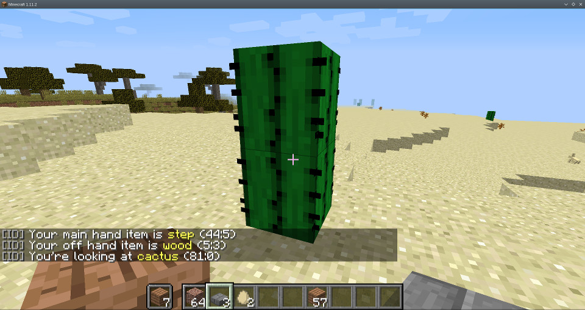

#ID
A simple plugin that shows item details.
Should be useful for architects and admins.

##Usage
You can use */id* to show generic information about the items you got in both of your hands and the block you are looking at (maximal distance is 10 blocks)

The */iddetail* command is showing you a few more details, like block humidity, redstone value and some more stuff

You can enter a player name to know what others would see, for example */id TheSamei*. If the player is not online, the command will slently fail and will show your view instead

##Permissions
For */id*, the permission needed is *id.id*
For */iddetail*, the permission needed is *id.detail*

WhoGotTheId?