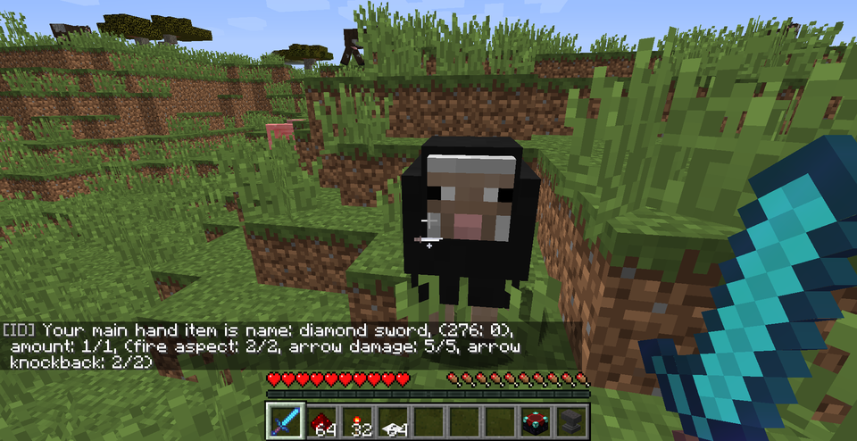
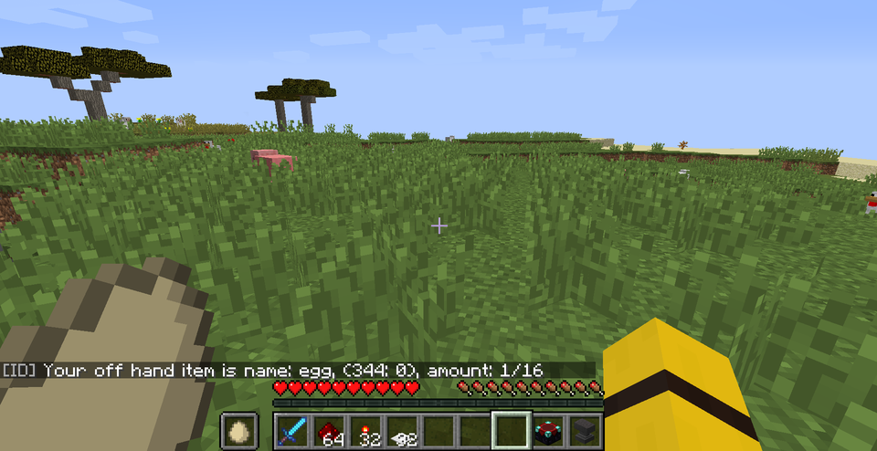
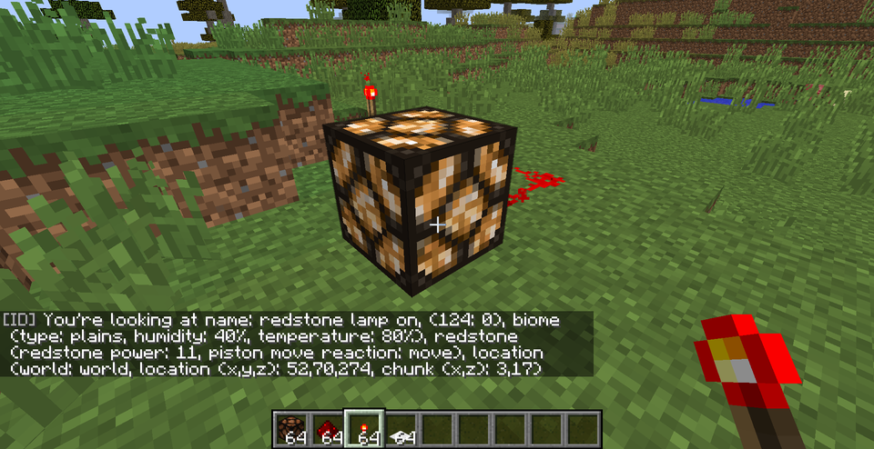

# ID v1.1.0 by KarlTheBee
A simple plugin that shows item details.
Should be useful for architects and admins.

## Commands
There are four different commands to use.
The **/id** command shows information about the item in your hand
The **/idoff** command shows information about the item in your offhand
The **/idblock** command shows information about the block you are looking at
The **/idall** command for everything above combined

Last but not least **/id help** will show you a quick help

### Arguments
If you enter these commands above, you will get basic information. To get more infformation, you need to enter arguments

**b**   *biome information*
**l**   *location information*
**e**   *enchantmement information*
**r**   *redstone information*
**all**   *all of the above combined. is like entering* **bler***

You can combine these arguments, for example **/idblock br** will show biome and redstone information.

Examples : **/id e**, **/idblock b**, **/idblock blr**, **/idoff all**

## Permissions
The permissions needed are *id.id* (for main hand), *id.off* (for offhand), *id.block* (for block info) and *id.all* for

## Example images

## TL:DR
Just enter **/idall all** and you will be fine

WhoGotTheId?